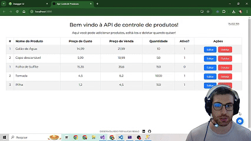
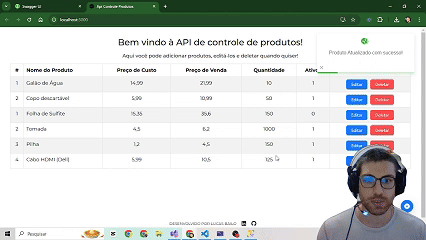
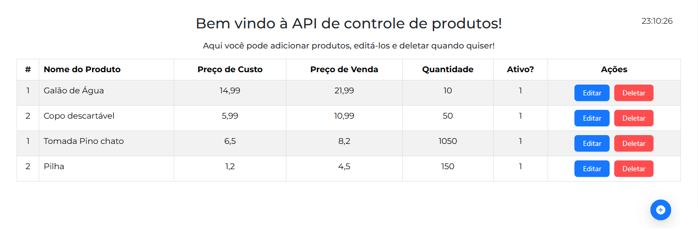

## Welcome an API Project - Front End! 👋

# API Produtos!

## Test the project yourself: [Teste the project here!!!](https://github.com/lucasbailo/front-end-api-produtos)

### Create / Add a new Product



## Edit a product 


## Delete an item



## Home Page




## Some code that I'm proud of
```js
const handleEdit = (id) => {
    handleShow()
    axios.get(`https://localhost:7284/api/ProdutoClass/${id}`)
        .then((result) => {
            setEditNome(result.data.nome)
            setEditCusto(result.data.custo)
            setEditVenda(result.data.venda)
            setEditQuantidade(result.data.quantidade)
            setEditIsActive(result.data.isActive)
            setEditId(id)
        })
        .catch((error => {
            console.log(error)
        }))
}
```

## Built with

- `React`
- [`Bootstrap`](https://www.npmjs.com/package/bootstrap)
- [`Ant Design`](https://www.npmjs.com/package/antd)
- [`Toastify`](https://www.npmjs.com/package/react-toastify)

## You Can
- **C**reate Items;
- **R**ead a database;
- **U**pdate items;
- **D**elete items if you want.

## Back-End repository: [See Back-End!](https://github.com/lucasbailo/back-end-api-produtos)

## Author

- Website - [My GitHub](https://github.com/lucasbailo)
- Frontend Mentor - [@lucasbailo](https://www.frontendmentor.io/profile/lucasbailo)
- Instagram - [@lucassbailo](https://www.instagram.com/lucassbailo/)
- LinkedIn - [Lucas Bailo](https://www.linkedin.com/in/lcsbailo)